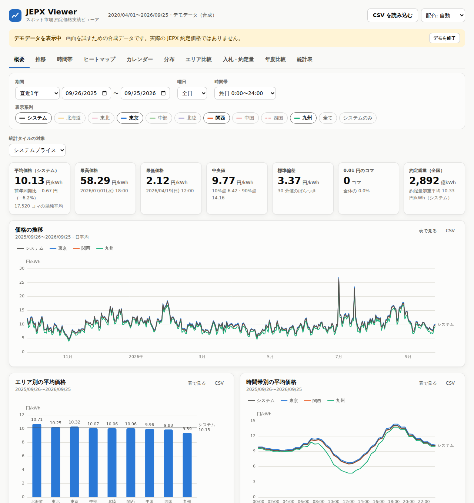
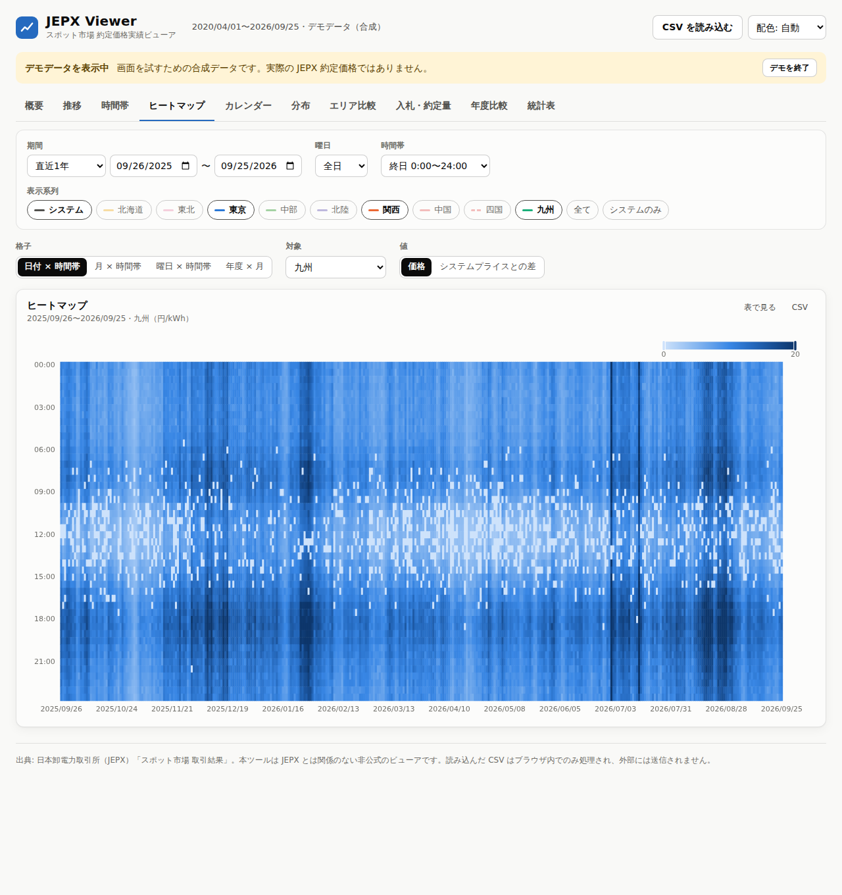
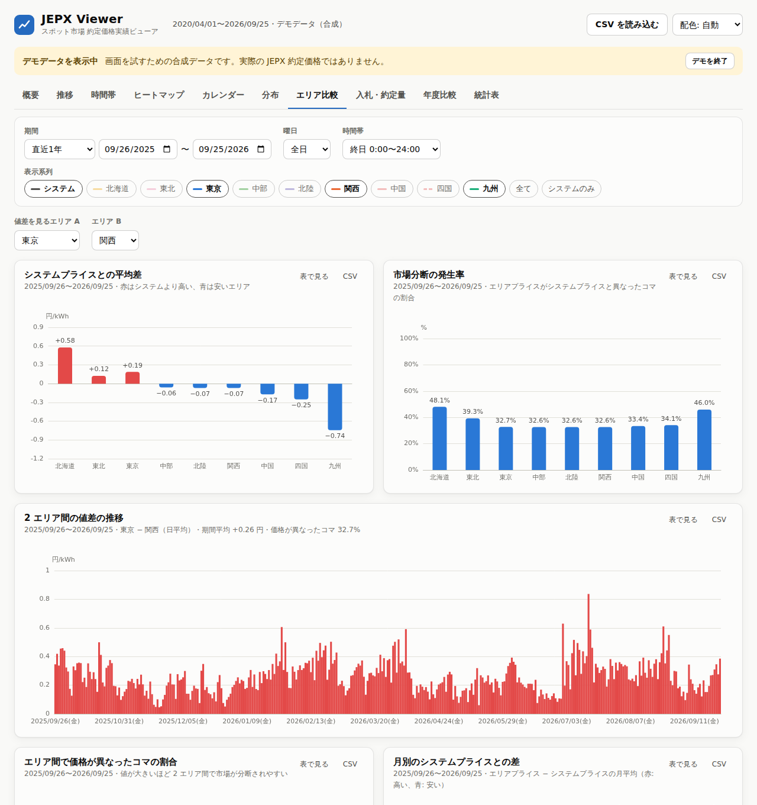
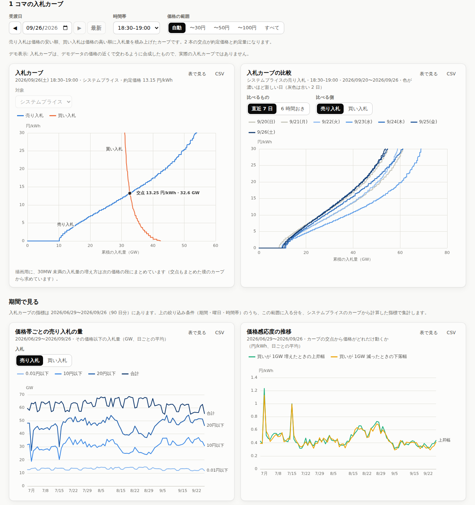

# JEPX Viewer

JEPX（日本卸電力取引所）**スポット市場の約定価格実績**を、推移・時間帯・ヒートマップ・カレンダー・分布・エリア比較・年度比較など、さまざまな切り口で可視化するブラウザ向けツールです。

- JEPX が公開している年度別 CSV（`spot_summary_YYYY.csv`）をそのまま読み込めます（Shift_JIS / UTF-8 自動判定）
- `npm run fetch` で全年度のデータを自動取得し、起動時に読み込むこともできます
- 入札カーブ（受渡日・時間帯ごとの売り・買いの入札の積み上げ）も `npm run fetch` で直近 90 日分を取得し、カーブの形・日や時間帯による違い・価格帯ごとの入札量・価格感応度を見られます
- JEPX が公表している価格感応度（売りか買いを 0.5GW、1GW、5GW 足したときのシステムプライス。2021 年度から）も `npm run fetch` で取得し、入札カーブから計算した目安と並べて見られます。エリアごとの価格感応度と、約定価格が 0.01 円になる量や高騰する量（買いがどれだけ増減したときか）も入札カーブから計算します
- `npm run build:single` で、ダブルクリックで開ける 1 ファイル版（HTML 1 つ）も作れます。共有フォルダなどで配れ、データを別のフォルダに分けてデータだけを更新することもできます
- すべての処理はブラウザ内で完結し、読み込んだデータは外部に送信しません
- 絞り込み条件・表示中のタブは URL に保存されるので、同じ切り口をリンクで共有できます



> README の画面例はすべて **デモ用の合成データ** で作成しており、実際の約定価格ではありません。

## 可視化の切り口

画面上部の絞り込み（**期間**・**曜日区分**（全日／平日／土日祝）・**時間帯**（終日・日中 8〜20 時・夜間など、30 分単位で任意指定も可）・**表示系列**）は、すべてのタブに共通で効きます。

| タブ | 内容 |
| --- | --- |
| 概要 | 平均・最高（日時）・最低・中央値・標準偏差・0.01 円コマ数・約定総量と約定量加重平均の統計タイル、前年同期比、推移・エリア別平均・時間帯別平均 |
| 推移 | 30 分値〜日・週・月・年度・暦年の粒度で、平均・最高・最低・中央値の推移。1 系列なら最低〜最高の帯を表示。系列ごとに分割した小さな図（縦軸共通）では、システムプライスや任意のエリアを「各図に重ねる線」として重ねて比較可。下部のスライダーやホイールで拡大した範囲は、粒度・集計・表示方法を変えても保たれる（期間の絞り込みを変えると解除） |
| 時間帯 | 日内カーブを系列・季節（冬／夏／春／秋）・平日／土曜／日祝・年度で比較。コマごとの価格のばらつき（箱ひげ図） |
| ヒートマップ | 日付×時間帯、月×時間帯、曜日×時間帯、年度×月の格子。エリアプライスとシステムプライスの差（発散色）も表示可 |
| カレンダー | 日平均・日最高・日最低・日内の値幅・0.01 円コマ数・システムとの差を年度別カレンダーに表示 |
| 分布 | ヒストグラム（階級幅を選択可）、価格持続曲線、月・年度・曜日・時刻・エリア別の箱ひげ図 |
| エリア比較 | 「比較の基準」（システムプライスまたは任意のエリア）との平均差、市場分断の発生率、月別の差。2 エリア間の値差（例: 東京 − 関西）の要約（どちらが高かったコマの割合、最大の値差と日時）、推移、時間帯別の平均と高かった側の割合、分布、ヒートマップ（日付 × 時間帯などの格子）。エリアの組み合わせごとの、価格が異なったコマの割合と平均値差（9 × 9） |
| 入札・約定量 | 売り入札量・買い入札量・約定総量の推移と時間帯別平均、約定総量とシステムプライスの散布図 |
| 入札カーブ | 受渡日・時間帯ごとの売り・買いの入札カーブと交点。対象にエリアを選ぶと、日付や時間帯を変えても、そのエリアの価格を決めたカーブ（市場分断していれば分断エリアのカーブ、1 エリアだけで分断した単エリアは推定）を表示。カーブの比較（直近 7 日・6 時間おき・自由に選んだ日と時間帯）。表示中のカーブの入札の大きな段（その価格で増えた量の大きい順）。単エリアが 1 つだけのコマ（そのエリアのカーブを推定し、約定価格で補正できるコマ）を、エリア別と時間帯別のコマ数、日付 × 時間帯の図で探せ、押すとそのコマのカーブを表示（前後のそのようなコマへ移るボタンと、直近のそのようなコマを比較の図に重ねるボタンもある）。そのようなコマの推定カーブから各コマの大きい 10 段を集め、同じような価格と量の段が何コマに出てくるか（何度も出てくる段）を、価格 × 量の図と上位 10 の一覧で表示。価格感応度として、1 コマの買いの増減と約定価格の図（約定価格が 0.01 円になる量、20 円と 50 円を超える量、売りが尽きる量、買いを ±0.5GW、±1GW、±5GW 増減したときの価格と JEPX の公表値）、エリア別の価格感応度と 0.01 円や高騰の目安までの買いの増減（押すと対象をそのエリアにする）、それらの推移（システムプライスは JEPX の公表値と入札カーブから計算した目安、エリアはボタンを押すとカーブを 1 日ずつ読んで計算）。期間で見る図として、価格帯ごとの入札量（0.01 円以下の売り、最も高い価格の買いなど）の推移、指標のヒートマップ。`npm run fetch` で取得した入札カーブを使います（デモでは合成したカーブを表示） |
| 年度比較 | 同じ月どうしを年度で重ねた推移、年度別平均、年度×エリアの平均 |
| 統計表 | 日・週・月・年度・暦年・曜日・時刻・全体の単位で「全系列の平均」または「1 系列の統計量（しきい値以上のコマ数、約定量加重平均を含む）」を一覧。表の CSV と、絞り込み後の 30 分値 CSV（JEPX と同じ列名）を保存可 |

ヒートマップとカレンダーの色の範囲と、時間帯、分布、年度比較の各タブのグラフの軸の範囲は、既定では選んだ対象（システムプライスまたはエリア）や表示系列に合わせて決めます。
そのため対象を切り替えると範囲も変わり、色やグラフの高さをそのままでは比べられません。
「全エリア共通」を選ぶと、システムプライスと 9 エリアのどれを選んでも同じ範囲になります。

どの図も右上の「表で見る」で数値の表に切り替えられ、「CSV」でその図のデータを保存できます。配色は自動／ライト／ダークを選べます。

<p>
  
  
</p>



## 使い方

### 必要なもの

- Node.js 22.19 以上（LTS の 22 系または 24 系）

```sh
npm ci
```

`npm ci` は `package-lock.json` に記録されたバージョンとハッシュ値のとおりにパッケージをインストールします。記録と食い違う場合はインストールを中止し、`package-lock.json` を書き換えることもありません。

### 1. データを自動取得して使う

```sh
npm run fetch   # JEPX から 2005 年度〜今年度の CSV（価格感応度は 2021 年度から）と、直近 90 日分の入札カーブを取得し public/data/ に変換・保存
npm run dev     # http://localhost:5173 を開く
```

- 2 回目以降は、確定済みの過去年度をスキップして **今年度と前年度だけ** を取り直します（`--force` で全年度を再取得）。
- 取得元は JEPX のスポット市場ページ（<https://www.jepx.jp/electricpower/market-data/spot/>）の年度別 CSV です。サイトの仕様が変わった場合は `--url-template` で取得元 URL を指定できます。
- 価格感応度は、同じページの年度別 CSV（`virtualprice_YYYY.csv`。2021 年度から）を取引結果と一緒に取得し、取引結果の年度ファイルに入れます（取引結果のある日だけ）。
  前の版で取得した年度ファイルに価格感応度が無ければ、次の `npm run fetch` で価格感応度だけを取得して足します。
  取得できなかったときや `--no-sensitivity` のときは、前に取得した価格感応度を残します。
- 入札カーブは、受渡日ごとの入札カーブの CSV（`spot_bid_curves_YYYYMMDD.csv`）と分断エリアの CSV（`spot_splitting_areas_YYYYMMDD.csv`）を、既定で直近 90 日分（翌日受渡の分まで）取得します。取得済みの日は取り直さないので、2 回目以降は新しい日の分だけです。1 日あたり 2 ファイルを間隔を空けて取得するため、初回は数分かかります。
- 入札カーブは、描画用に間引いて保存します（売り・買いそれぞれの合計量の 0.1% 未満の量の増え方は次の価格の段にまとめる。グラフでは 1 画素より小さい差です）。価格帯ごとの入札量・交点・価格感応度などの指標と、単エリアのカーブの推定に使う「システムプライス − 分断エリアの合計」は、間引く前のカーブから計算しています。
- 前の版で取得・変換したデータは、そのままでも表示できます。取引結果のブロック入札の量と、間引く前のカーブから求めた差を使って単エリアのカーブを推定するには、取引結果は `npm run fetch -- --force --no-curves`、入札カーブは `--force` 付きで取り直すか、手元の CSV を `--from-dir` で変換し直してください。
- 社内プロキシ環境では `HTTPS_PROXY` / `HTTP_PROXY` / `NO_PROXY` 環境変数がそのまま使われます。

| オプション | 説明 |
| --- | --- |
| `--from <年度>` / `--to <年度>` | 取得する年度の範囲（既定: 2005〜今年度） |
| `--curves-from <日付>` / `--curves-to <日付>` | 入札カーブを取得する受渡日の範囲（例: `2025-04-01`。既定: 直近 90 日〜翌日） |
| `--no-curves` | 入札カーブを取得しない |
| `--no-sensitivity` | 価格感応度（JEPX の公表値）を取得しない |
| `--force` | 取得済みの年度・日も取り直す |
| `--keep-csv` | 元の CSV を `public/data/raw/`（入札カーブと分断エリアは `raw/curves/`）にも保存する（あとで `--from-dir` で変換し直せる） |
| `--from-dir <ディレクトリ>` | 手元の CSV（ダウンロード・保存しておいたもの）を変換する（通信しない。複数指定できる。下記） |
| `--url-template <URL>` | 取得元 URL（`{fy}` が年度に置き換わる） |
| `--curves-url-template <URL>` | 入札カーブの取得元 URL（`{dir}` が `spot_bid_curves` / `spot_splitting_areas`、`{file}` がファイル名に置き換わる） |
| `--sensitivity-url-template <URL>` | 価格感応度の取得元 URL（`{fy}` が年度に置き換わる） |
| `--delay <ミリ秒>` | 連続取得の間隔（既定: 1500） |

例: `npm run fetch -- --from 2016`、`npm run fetch -- --curves-from 2026-04-01`（入札カーブを 2026 年 4 月から）

`--from-dir` では、フォルダ（サブフォルダも含む）の CSV を、ファイル名ではなく列名で「取引結果」「価格感応度」「入札カーブ」「分断エリア」に見分けて変換します。

- 入札カーブの受渡日は CSV の「電力受渡日」の列で決まるので、ファイル名は問いません。1 つの CSV に何日分入っていても構いません。
- 価格感応度の CSV は、取引結果のある日にだけ入れます。取引結果の CSV が無い年度は、変換済みの年度ファイルに足します。価格感応度の CSV が無い年度を変換し直しても、変換済みの価格感応度は残します。
- `--from-dir` は複数指定できます。入札カーブと分断エリアの CSV が別々のフォルダにあっても、受渡日で突き合わせます。別々に変換した場合も、あとから変換した分断エリアの名前を、変換済みの入札カーブに付け直します。
- システムプライスの行の「分断エリア連番」は、JEPX の形式（空）でも `-1` でも構いません。表計算ソフトで保存し直した `-1.0`・`0.0` のような小数の形も読めます。システムプライスのカーブが 1 コマも読めなかった日は保存せず、ログに表示します。
- 入札カーブは、既定ではフォルダにある分をすべて変換します（`--curves-from` / `--curves-to` を指定したときだけ、その受渡日に絞ります）。
- 読めない CSV は飛ばし、最後に一覧を表示します。

例: `npm run fetch -- --from-dir D:\JEPX\bid_curves --from-dir E:\archive\splitting_areas`

#### 入札カーブを確かめる

```sh
npm run check:curves                                 # 取得済みの全期間
npm run check:curves -- --date 2026-09-26            # 1 日分（コマごとの一覧も出す）
npm run check:curves -- --date 2026-09-26 --slot 9   # 1 コマの数字を詳しく（--slot は 1〜48 のコマ）
```

取得済みの入札カーブを取引結果と突き合わせて、市場分断したときのカーブの作りと単エリアの推定を確かめます（`--from` / `--to` で期間、`--data` でデータの場所を指定できます）。

- 「システムプライス − 公表されている分断エリアのカーブの合計」が、単エリアの無い分断では価格によらず一定か、単エリアのある分断では価格によって変わるか（市場分断・単エリアの有無ごと、月ごと）
- 公表されている分断エリアのカーブが、そのエリアの約定価格で交わるか
- 単エリアが 1 つのコマで、推定したカーブが補正しなくてもそのエリアの約定価格で交わるか
- 取引結果に JEPX の価格感応度の公表値があれば、システムプライスのカーブをずらして計算した目安と比べます（買いの増減ごとに、約定価格の動きが公表値と同じコマの割合、差の大きさの平均、公表値の動きが目安以下のコマの割合）
- 1 コマを詳しく見るときは、入札量の合計、取引結果（入札量・ブロック入札の量・約定総量）、ブロック入札の約定の違い、価格ごとの「システムプライス − 分断エリアの合計」、約定総量との突き合わせも出します。価格感応度の目安と公表値、0.01 円になる量や 20 円と 50 円を超える量も出します

JEPX の実データ（2026 年 6 月 29 日〜9 月 26 日の 90 日・4,320 コマ）では、次のとおりでした。2022〜2025 年の日も数日ずつ見て、同じでした。

- 単エリアの無い分断（987 コマ）: システムプライス − 分断エリアの合計は、すべてのコマで価格によらず一定（中央値で売り −2.73 GW・買い −3.01 GW）。分断エリアのカーブには、連系線でやりとりする量が価格によらない量で入っている
- 単エリアのある分断（3,333 コマ）: すべてのコマで差が価格によって変わる。システムプライスのカーブには、単エリアの入札も入っている
- 単エリアが 1 つのコマ（1,306 コマ）: 推定したカーブは、96.1% のコマで補正しなくても約定価格で売りと買いが釣り合い、残りも補正は中央値 3 MW

価格感応度は、2026 年 7〜9 月の 16 日（768 コマ）の間引く前のシステムプライスのカーブを使い、JEPX の公表値と比べました。
カーブの交点は、すべてのコマで公表されているシステムプライスと同じでした。
一方、買いを増減したときの約定価格の動きが公表値と同じだったのは、±0.5GW で 39〜46%、±1GW で 23〜24%、±5GW で 2〜3% のコマでした（差の大きさの平均は、それぞれ 0.20〜0.25 円、0.40〜0.43 円、1.7〜2.1 円）。
公表値の動きは 98〜100% のコマで目安以下で、買いを 0.5GW 足すと約定価格が下がったコマもありました。
カーブをずらすだけでは価格は下がらないので、この違いは、公表値の計算でブロック入札の約定も判定し直していることによるとみられます。
そのため、この画面の価格感応度は「ブロック入札の約定を変えないときの目安」として示しています。
なお、`npm run check:curves` は描画用に間引いたカーブをずらして比べるため、交点が公表のシステムプライスと同じになるコマは少なくなります（2026 年 9 月 23〜25 日の 144 コマで 81%）。
価格の動きの差の大きさの平均は、間引く前のカーブで比べたときとほぼ同じでした。

### 2. CSV ファイルを直接読み込む

JEPX のサイトから年度別 CSV をダウンロードし、画面にドラッグ&ドロップするか「CSV を読み込む」から選択します（複数ファイル可）。取得済みデータと重なる日は、読み込んだ CSV の値が優先されます。

### 3. デモデータで試す

データが無い状態で「デモデータを表示」を押すと、画面を試すための合成データを表示します（画面上部に常に「デモデータ」と表示されます）。

### 静的サイトとして公開する

```sh
npm run build    # dist/ に出力（相対パスなので任意のサブパスに置ける）
npm run preview  # ビルド結果の確認
```

`npm run fetch` 済みであれば、`dist/data/` に価格データ・入札カーブも含まれます。GitHub Pages には `.github/workflows/pages.yml`（手動実行）でデプロイできます。リポジトリの Settings → Pages → Source を「GitHub Actions」にしてから、Actions タブで「Deploy to GitHub Pages」を実行してください。`include_data` をオンにするとビルド時に JEPX からデータ（価格データと直近 90 日分の入札カーブ）を取得して含めます。

公開用ビルドには、スクリプト・通信・画像などの読み込み元を同じサイト内に限る CSP（Content Security Policy）を `<meta>` タグで入れています（設定は `vite.config.ts`。開発サーバーには入れていません）。

> **公開時の注意**: JEPX が公開するデータの利用・再配布については、JEPX の利用条件をご確認ください。価格データを含めずに公開した場合でも、閲覧者が各自ダウンロードした CSV を読み込んで使えます。

### 1 つの HTML ファイルにまとめて配る

Web サーバーを用意しなくても、ダブルクリックでブラウザ（Edge・Chrome など）で開ける 1 ファイル版を作れます。共有フォルダや Teams で配れます（Teams などからは、一度ダウンロードしてから開いてください）。`dist/index.html` はファイルから直接開くとブラウザがスクリプトを読み込まないため、ファイルで配るときはこちらを使います。

```sh
npm run fetch          # 埋め込むデータを取得（取得済みなら不要）
npm run build:single   # dist-single/jepx-viewer.html に出力
```

| オプション | 説明 |
| --- | --- |
| `--from <年度>` / `--to <年度>` | 埋め込む年度の範囲（既定: 取得済みの全年度） |
| `--no-data` | データを埋め込まない（各自が JEPX の CSV を読み込んで使う） |
| `--split` | データを HTML に入れず、HTML と同じ場所の `data` フォルダに分けて出力する（下記） |
| `--curve-days <日数>` | 1 コマの入札カーブを直近何日分入れるか（既定: 7。`--split` では取得済みのすべて） |
| `--no-curves` | 入札カーブを入れない |
| `--out <ファイル>` | 出力先（既定: `dist-single/jepx-viewer.html`） |

例: `npm run build:single -- --from 2021`

- ファイルの大きさは、データなしで約 0.8 MB、1 年度あたり約 1.3 MB 増えます（全年度で約 30 MB が目安）。
- 入札カーブは、期間で見る図の指標をすべてと、1 コマのカーブを直近 7 日分入れます（1 コマのカーブは 1 日分が大きいため。日数は `--curve-days` で変えられます）。
- データは作成した時点のものです。最新にするには作り直して配り直します。今年度の CSV を各自が読み込んで最新にすることもできます（読み込んだ CSV の値が優先されます）。
- 1 ファイル版は外部と一切通信しません（CSP で通信と外部からの読み込みを禁止しています）。
- データを埋め込んだファイルを社内で配る場合も、JEPX の利用条件と社内のルールを確認してください。

#### データを別のフォルダに分ける（共有フォルダ向け）

`--split` を付けると、データを HTML に入れず、HTML と同じ場所の `data` フォルダに出力します。データを更新するときは `data` フォルダを差し替えるだけで済み、見る人はページを開き直せば最新のデータになります。開いたときに読み込むのは表示している期間の年度（入札カーブは表示する日）だけなので、全年度・取得済みの入札カーブをすべて置いても速く開けます。

```sh
npm run fetch
npm run build:single -- --split
```

```
dist-single/
  jepx-viewer.html     見る人はこれを開く（アプリを更新したときだけ差し替える）
  data/                データ（manifest.js、年度ごとの spot/fyYYYY.js、入札カーブの curves/）
```

- HTML と `data` フォルダは、同じ場所に並べて置いてください。
- `--out` に共有フォルダの場所を指定すると、そこへ直接書き込めます（例: `npm run build:single -- --split --out "\\server\share\JEPX\jepx-viewer.html"`）。`npm run fetch` とこのコマンドを Windows のタスク スケジューラなどで定期的に実行すれば、毎日の更新も自動化できます。
- ファイルから開いたページは JSON を読めないため、データは数値の一覧を登録するだけの JavaScript ファイル（.js）にしています。`data` フォルダの中身もブラウザで実行されるので、共有フォルダは更新する人だけが書き込めるようにしてください（HTML も同じです）。読み込むのは `data` フォルダの決まった名前のファイルだけで、ネット上のスクリプトや通信は CSP で禁止しています。

## 集計の定義

| 項目 | 定義 |
| --- | --- |
| 平均価格 | 対象コマ（30 分）の価格の単純平均。約定量で重み付けした値は「約定量加重平均」（システムプライスのみ、約定総量で加重） |
| 0.01 円のコマ | 価格が入札価格の下限 0.01 円/kWh となったコマ |
| 市場分断の発生率 | 比較の基準（既定はシステムプライス。任意のエリアも選べる）と価格が異なった（差が 0.005 円超の）コマの割合 |
| エリア間で価格が異なったコマ | 2 エリアの価格が異なったコマの割合（値差の発生率） |
| 値差 | 2 エリアの価格の差（エリア A − エリア B、30 分ごと）。差が 0.005 円以下のコマは「価格が同じ」とみなす（市場分断の発生率と同じ判定）。値差の分布は、価格が同じだったコマを除いて数える |
| 土日祝 | 土曜・日曜・国民の祝日・振替休日・国民の休日（祝日は「国民の祝日に関する法律」の規定から計算。2000〜2050 年について [@holiday-jp/holiday_jp](https://github.com/holiday-jp/holiday_jp-js) の祝日データと一致することをテストで確認） |
| 年度 | 4 月〜翌 3 月 |
| 季節 | 春 3〜5 月、夏 6〜8 月、秋 9〜11 月、冬 12〜2 月 |
| 時間帯 | 時刻コード 1〜48 を 0:00〜23:30 開始の 30 分コマとして扱う。終了時刻が開始時刻より前の指定（例: 夜間 20:00〜8:00）は、各受渡日の 0:00〜8:00 と 20:00〜24:00 を対象にする（日別の集計も受渡日単位） |
| 1 日あたりの量 | 入札・約定量の推移は、期間の長さに依らず比べられるよう「1 コマ平均 × 対象コマ数」で表示 |
| 全エリア共通の範囲 | システムプライスと 9 エリアのどれを対象にしても同じになる範囲。ヒートマップとカレンダーの色は、それぞれで「対象ごと」の範囲を決め、それらをすべて含む範囲（システムプライスとの差は 9 エリアで決める）。箱ひげ図の縦軸はすべてのひげ（10〜90%点）が、折れ線と棒グラフの縦軸はすべての値が入る範囲（表示系列で選んでいない系列も含める）。ヒストグラムは、全エリアの最小値から 99.5%点の最大までを階級に分け、縦軸は全エリアのコマ数の最大までにする。期間などの絞り込みや、グラフの表示の設定（格子、指標、切り口、統計量、階級の幅、箱ひげ図のグループ）を変えると決め直す |
| 入札カーブ | 価格ごとの累積の入札量（売りはその価格以下、買いはその価格以上の入札の合計。MW）。システムプライスのカーブのほか、市場分断が起きたコマは分断エリア（価格が同じになったエリアのまとまり）ごとのカーブがある |
| カーブの交点 | 売りの累積が買いの累積以上になる最初の価格で、2 本のカーブが交わる点（約定価格・約定量に相当）。1 コマの図の交点は描画用に間引いたカーブから求めるため、公表の約定価格と少し異なることがある |
| エリアのカーブ | そのコマでエリアの価格を決めたカーブ。市場分断していなければシステムプライスのカーブ、分断していればそのエリアを含む分断エリアのカーブ |
| 分断エリアのカーブ | 市場分断したコマで JEPX が公表する、2 エリア以上のまとまりのカーブ。そのまとまりの入札に、連系線で他の分断エリアとやりとりする量が、送る側では買い（最も高い価格）、受ける側では売り（0 円）として入っている（そのため、そのエリアの約定価格で交わる。公表されている分断エリアの入札量の合計が、システムプライスより多くなることもある）。システムプライスのカーブには、単エリアを含む全エリアの入札が入っている。ブロック入札は、システムプライスの計算と市場分断の計算とで約定するものが違い、カーブには約定したものが価格によらない量で入っている。いずれも JEPX の実データで確かめた（`npm run check:curves`） |
| 単エリアのカーブ（推定） | 1 エリアだけで分断したエリア（単エリア）は JEPX がカーブを公表していないため、次のように推定する（破線で表示）。① システムプライスのカーブから、公表されている分断エリアのカーブを引く（間引く前のカーブから 1MW 単位で求めたもの）。② ブロック入札の約定の違い（システムプライスのカーブの入札量の合計と、取引結果の入札量 − 約定しなかったブロック入札 の差）を差し引く。③ 引くと、分断エリアのカーブに入っている連系線の量の分だけ売り・買いとも引き過ぎになるので、売り・買いに同じ量を足して 0 以上に戻す（同じ量なので交点の価格は変わらない。足す量そのもの（単エリアの最も安い売り・最も高い買いの量）は分からないため、少ない方の端を 0 にする。横軸の位置は目安）。単エリアが 1 つのときは、こうして作ったカーブはそのエリアの約定価格で交わる。交わらないとき（取引結果にブロック入札の量が無いときなど）は、売りか買いの一方に足して合わせる（約定価格での売りの量が買いより多ければ買いに、少なければ売りにその差を足す）。単エリアが複数のときはエリアごとに分けられないため、合わせたカーブ（補正なし）と各エリアの約定価格を表示し、同じ日のうち、そのエリアだけが単エリアになった時間帯へ移るボタンを出す。引いた差が価格によらずほぼ一定で、単エリアの入札の形が残らないときは推定できないとする |
| 単エリアが 1 つだけのコマ | 取引結果の約定価格から判定する。連系線でつながったエリア（北海道と東北、東北と東京、東京と中部、中部と北陸、中部と関西、北陸と関西、関西と中国、関西と四国、中国と四国、中国と九州）のうち価格が同じもの（差が 0.005 円以下）を 1 つの分断エリアとみなし、1 エリアだけの分断エリアが 1 つだけのコマ。離れたエリアは価格が同じでも（どちらも 0.01 円など）別の分断エリアとする。1 コマの入札カーブがある日から探す |
| 入札の大きな段 | 階段状のカーブで、価格が 1 段上がる（買いは下がる）ときに増えた入札量。描画用に間引いたカーブ（合計量の 0.1% 未満の増え方は次の段にまとめたもの）から求める。最初の点は段にしない（推定したカーブの最初の点には、足した量が入っている） |
| 何度も出てくる段 | 選んだエリアだけが単エリアになったコマの推定カーブから、各コマの大きい 10 段を集め、価格と量の格子のマスごとに、その段があったコマを数える（1 コマに同じマスの段が 2 つあっても 1 と数える）。価格は 1〜99%点を約 40 に分け（外れた価格は両端のマスに入れる）、量は 0 から最大までを約 25 に分ける。1 日分のカーブが数百 KB あるので、ボタンを押したときだけ読み込む |
| 価格帯ごとの入札量 | その価格以下の売り入札量、その価格以上の買い入札量。「最高価格」は最も高い価格の買い入札（価格を問わない買い）。期間で見る図の指標は、すべてシステムプライスのカーブから計算 |
| 価格感応度 | 買い入札を価格を問わず増やした（減らした）とき、約定価格が何円上がる（下がる）か。上昇幅は増やしたときの価格 − 約定価格、下落幅は約定価格 − 減らしたときの価格。JEPX の公表値は、999 円の買い（0.01 円の売り）を 0.5GW、1GW、5GW 足して約定計算をやり直したときのシステムプライスで、ブロック入札の約定も判定し直している。この画面の目安は、売りと買いのカーブの交点を買いの量だけずらして求め直したもので、ブロック入札の約定と、分断エリアのカーブでは連系線でやりとりする量を変えない。エリアは、そのエリアの価格を決めたカーブ（分断していなければシステムプライスのカーブ、分断していれば分断エリアのカーブか単エリアの推定）から求める（JEPX はエリアごとの価格感応度を公表していない）。1 コマの図、エリア別の図、エリアの推移は描画用に間引いたカーブから、期間の図のシステムプライスの目安は間引く前のカーブから求める |
| 0.01 円・高騰までの買いの増減 | 約定価格が 0.01 円になる買いの減少と、高騰の目安（20 円か 50 円）を超える買いの増加（MW。0 が実際の買い）。1 コマの図とエリア別の図は、カーブをずらして約定価格が変わる境目から求める。期間の図のシステムプライスは、入札カーブの指標から「0.01 円以下の売り − 買いの合計」「20 円以下の売り − 20 円以上の買い」のように求める（その価格ちょうどの入札の分だけ、1 コマの図と違うことがある）。売りが尽きる量は、それより買いが増えるとどの価格でも売りが買いに届かない量 |
| エリアの価格感応度の推移 | 対象にエリアを選んだときの価格感応度と 0.01 円・高騰までの買いの増減の推移は、1 コマの入札カーブのある日のカーブを 1 日ずつ読み、コマごとに計算する（ボタンを押したときだけ） |

読み込む列は、受渡日・時刻コード・売り入札量・買い入札量・約定総量・システムプライス・9 エリアのエリアプライスと、ブロック入札の量（売り・買いの入札総量と約定総量。単エリアのカーブの推定に使う）です（回避可能原価・α 値などの列は読み飛ばします）。列名はキーワードで判定するため、年度による列の追加・並びの違いにも対応します。
価格感応度の CSV（`virtualprice_YYYY.csv`）は、年月日、時刻コード、システムプライスと、売り・買いを 500MW、1000MW、5000MW 足したときのシステムプライスの列を読みます。

## 開発

```sh
npm test            # 単体テスト（CSV 解析・祝日判定・集計・入札カーブ・価格感応度・取得スクリプト・1 ファイル版の作成・入札カーブの確認）
npm run typecheck   # 型チェック
npm run sample      # 動作確認用の合成 CSV（JEPX と同じ列構成・Shift_JIS）を samples/ に作成
```

依存パッケージと GitHub Actions の新しい版は、Dependabot が毎月まとめて PR で知らせます（`.github/dependabot.yml`。公開から 7 日未満の版は提案しません）。

```
scripts/
  fetch-jepx.ts        JEPX からの取得と public/data への変換
  check-curves.ts      取得済みの入札カーブを取引結果と突き合わせて確かめる
  build-single.ts      ファイルで配る版（HTML 1 つ、または HTML と data フォルダ）の作成
  make-sample-csv.ts   合成サンプル CSV の生成
src/
  lib/                 データ処理（CSV 解析、祝日、選択・集計、データ形式、入札カーブ、デモデータ）
  ui/                  画面部品（テーマ、ECharts 設定、グラフカード、絞り込み行）
  views/               タブごとの可視化
  app.ts               データの読み込みと状態管理
tests/                 Vitest
```

主な技術: TypeScript / Vite / Apache ECharts。配色は色覚多様性に配慮した検証済みのカテゴリ色を使い、各エリアの色は表示系列を切り替えても変わりません（システムプライスは基準線として無彩色、四国は中国と同系色の破線）。

## 免責

本ツールは JEPX とは関係のない非公式のビューアです。表示内容の正確性は保証しません。取引・業務上の判断には JEPX の公式情報をご確認ください。
